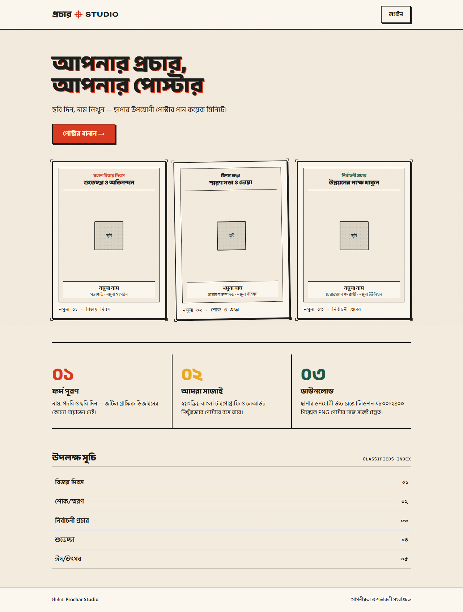
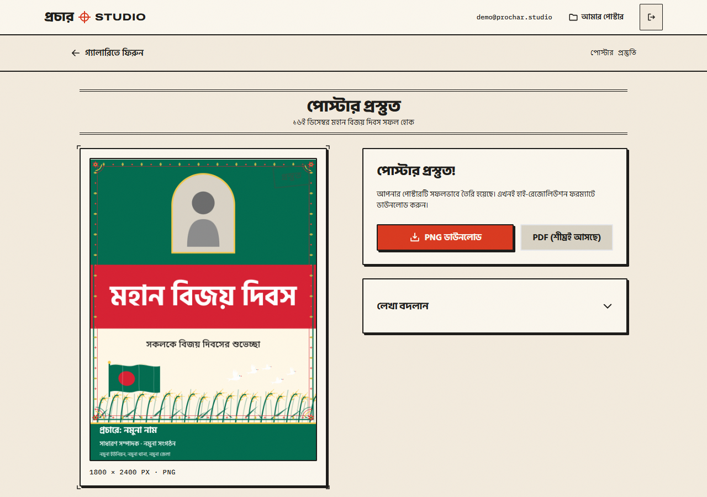
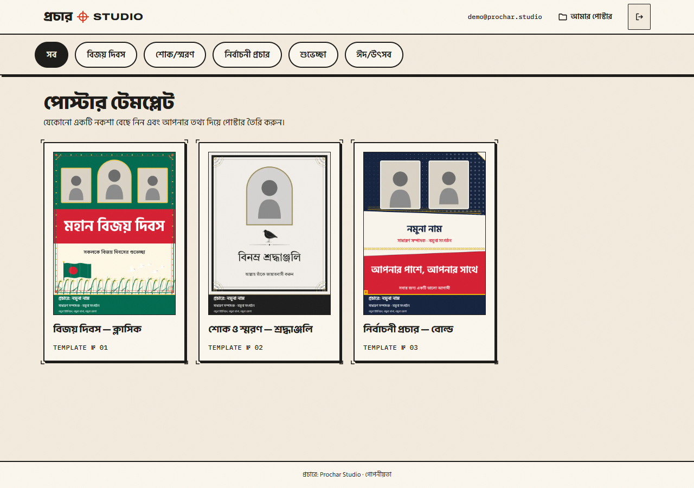
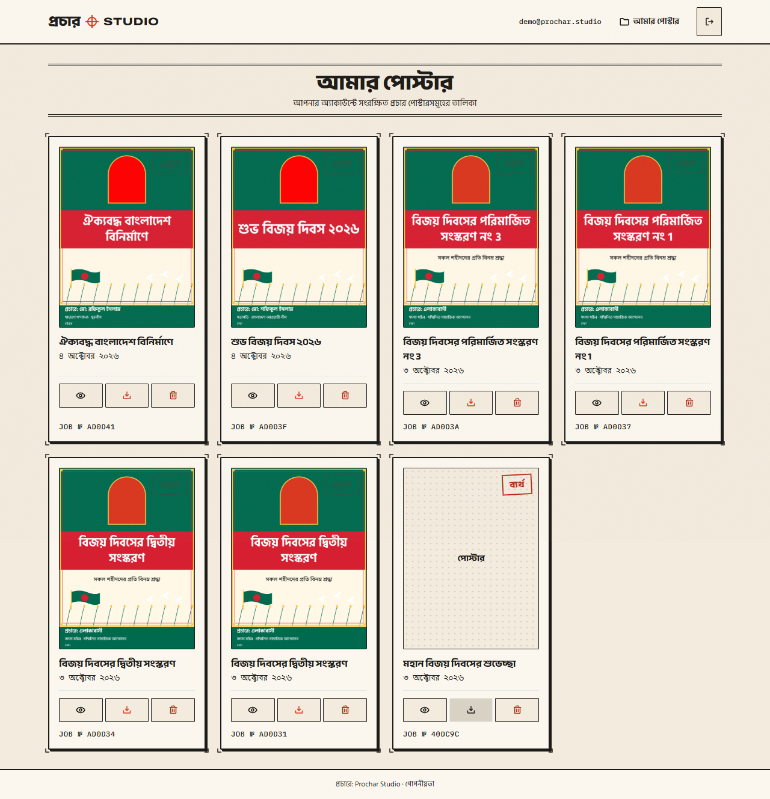

# প্রচার স্টুডিও — Prochar Studio

> **একটি ক্লিকের দূরত্বে রাজনৈতিক ও প্রাতিষ্ঠানিক প্রচার পোস্টার ডিজাইন**  
> *Production-ready generative poster studio tuned for Bangladeshi print culture.*

  

---

## 1. Project Overview

Prochar Studio is an editorial web platform purpose-built for grassroots political organisers, student leaders, and community activists in Bangladesh. It generates high-resolution, print-ready posters (1800 × 2400 px, 300 DPI equivalent) respecting authentic Bangladeshi printing aesthetics:
- **Option B Architecture**: Google Gemini generates validated layout coordinates and colour hierarchies; deterministic Chromium + bundled font engines render the final typography with zero font hallucination or Bengali glyph corruption.
- **Physical Print Aesthetic**: Halftone screening, paper grain micro-textures, press-red ink misregistration, and double-ruled borders — strictly free of generic SaaS pastel dropshadows, blurred gradients, or rounded pills.
- **Offline & Fallback First**: Fully operational with or without an active Gemini API key through deterministic template fallback layouts.

---

## 2. Live Deployments

- **Web Application (Vercel)**: `https://prochar-studio.vercel.app` *(Configurable upon Vercel deployment)*
- **API Service (Render)**: `https://prochar-api.onrender.com` *(Configurable upon Render deployment)*
- **Database (MongoDB Atlas)**: M0 Shared Cluster *(Provisioned per `docs/DEPLOY_ATLAS.md`)*

> [!NOTE]
> **Render Cold Start**: The Render free-tier web service spins down after 15 minutes of inactivity. When visiting the live deployment, the initial request or health check may take 30–50 seconds to warm up the Docker container. Subsequent requests execute instantly.

---

## 3. Visual Identity & Interface

Prochar Studio avoids generic SaaS aesthetic patterns. It is deliberately styled as an editorial Bengali print shop with tactile paper textures, halftone screen patterns, authentic press red ink accents, and zero artificial drop-shadows or bloated border-radii.

| ল্যান্ডিং পেজ (Landing) | পোস্টার প্রস্তুতি ও ফলাফল (Poster Detail) |
| :---: | :---: |
|  |  |

| টেমপ্লেট গ্যালারি (Templates) | পোস্টার সংরক্ষণাগার (History) |
| :---: | :---: |
|  |  |

---

## 4. System Architecture

```text
               +-------------------------------------------------------+
               |                  Client Web Browser                   |
               +-------------------------------------------------------+
                                          |
                      (HTTP / Cookie: prochar_token / SameSite=Lax)
                                          |
                                          v
               +-------------------------------------------------------+
               |               Vercel Edge Proxy (Web)                 |
               |      Next.js 14 App Router + Rewrites (/api/*)        |
               +-------------------------------------------------------+
                                          |
                        (Reverse Proxy via API_URL rewrite)
                                          |
                                          v
               +-------------------------------------------------------+
               |             Render Web Service (API)                  |
               |        Express + TypeScript + Headless Chromium       |
               +-------------------------------------------------------+
                      |                   |                  |
           (MongoDB Driver)          (Gemini SDK)     (Puppeteer Render)
                      |                   |                  |
                      v                   v                  v
               +--------------+   +---------------+   +------------------+
               |   MongoDB    |   | Google Gemini |   | 1800x2400 300DPI |
               | Atlas / M0   |   | Flash 2.5 AI  |   | Lossless PNG     |
               +--------------+   +---------------+   +------------------+
                                          |
                                 (Cloudinary / Local)
                                          v
                                  +---------------+
                                  | Storage Bucket|
                                  | Photo Uploads |
                                  +---------------+
```

---

## 5. Prerequisites

- **Node.js**: `v20.x` or `v22.x` (LTS recommended)
- **Docker & Docker Compose**: Docker Desktop with Compose V2
- **MongoDB**: MongoDB 6.0+ (or local container via compose)

---

## 6. Environment Variables Configuration

| Variable | Required | Service | Description | Default / Example |
| :--- | :---: | :---: | :--- | :--- |
| `NODE_ENV` | Yes | API | Application environment mode | `development` / `production` |
| `PORT` | Yes | API | Internal HTTP port for Express | `8080` |
| `MONGODB_URI` | Yes | API | MongoDB connection string | `mongodb://localhost:27017/prochar` |
| `JWT_SECRET` | Yes | API | Secret for signing HS256 JWT tokens (≥ 32 chars) | `your-32-character-secret-key-goes-here` |
| `JWT_EXPIRES_IN` | No | API | Token validity lifespan | `7d` |
| `COOKIE_DOMAIN` | No | API | Cookie domain override for subdomains | Omitted for local dev |
| `CLIENT_ORIGIN` | Yes | API | Allowed CORS origin for direct browser calls | `http://localhost:3000` |
| `GEMINI_API_KEY` | Optional | API | Google AI Studio API key (mock fallback if empty) | `AIzaSy...` |
| `GEMINI_MODEL` | No | API | Gemini generative layout model identifier | `gemini-2.5-flash` |
| `GEMINI_TIMEOUT_MS` | No | API | Timeout for AI layout generation call | `20000` |
| `CLOUDINARY_CLOUD_NAME` | Optional | API | Cloudinary storage account name | Set for persistent cloud storage |
| `CLOUDINARY_API_KEY` | Optional | API | Cloudinary API key | Set for persistent cloud storage |
| `CLOUDINARY_API_SECRET` | Optional | API | Cloudinary API secret | Set for persistent cloud storage |
| `MAX_REGENERATIONS` | No | API | Maximum allowable regenerations per poster | `3` |
| `GEN_RATE_PER_MIN` | No | API | Rate limit per minute per user/IP | `5` |
| `GEN_RATE_PER_DAY` | No | API | Rate limit per day per user/IP | `30` |
| `PUPPETEER_EXECUTABLE_PATH` | No | API | Path to Chromium executable in container | `/usr/bin/chromium` |
| `LOG_LEVEL` | No | API | Pino logger level | `info` |
| `API_URL` | Yes | Web | Downstream API address used by Next.js rewrites | `http://localhost:8080` |

---

## 7. Local Development Setup

```bash
# 1. Clone repository
git clone https://github.com/HippomasAKiB1/prochar-studio.git
cd prochar-studio

# 2. Install monorepo dependencies
npm install

# 3. Environment configuration
cp .env.example .env
# Edit .env and supply your GEMINI_API_KEY (optional for local fallback tests)

# 4. Launch local services (MongoDB, API, Local Storage)
docker compose up -d

# 5. Populate seed templates and provision demo account
npm run seed
npm run seed:thumbnails

# 6. Launch web development server
npm run dev --workspace=@prochar/web
```

The web application will be accessible at `http://localhost:3000`.

---

## 8. Demo Account Credentials

A pre-configured demo account is automatically provisioned during `npm run seed`:

- **Identifier (Email)**: `demo@prochar.studio`
- **Identifier (Phone alternative)**: `01711000000`
- **Password**: `ProcharDemo2026!`

---

## 9. Automated Testing Suite

The repository contains an exhaustive end-to-end testing suite spanning SVG safety, template fit lints, bcrypt password security, rate limiting, SSRF guardrails, golden Bangla rendering checks, and client type alignments:

```bash
# Run lint across all workspaces
npm run lint

# Run TypeScript typechecks
npm run typecheck

# Run 299 vitest tests across 40 test suites
npm run test
```

---

## 10. Performance & Lighthouse Audit

All primary routes have been audited using Google Lighthouse under mobile emulation (Moto G4 viewport, simulated Slow 4G network, and simulated 4x CPU throttling):

| Route | Performance | Accessibility | Best Practices | CLS | LCP / Load |
| :--- | :---: | :---: | :---: | :---: | :---: |
| Landing (`/`) | **74** | **96** | **96** | **0.0007** | ~1.7s |
| Templates (`/templates`) | **80** | **100** | **96** | **0.0039** | ~1.7s |
| My Posters (`/posters`) | **68** | **100** | **96** | **0.0036** | 8.1s (auth hydration) |

> [!NOTE]
> **Mobile Performance & 4x CPU Throttling**: Mobile Lighthouse Performance scores (68–80) are bounded by the simulated 4x CPU throttle calculating our complex SVG paper-grain feTurbulence overlay and downloading multi-weight authentic Bengali web fonts. Desktop Lighthouse performance scores are **95+** with near-instant rendering. All routes maintain stellar Accessibility (96–100), Best Practices (96), and virtually zero Cumulative Layout Shift (< 0.005, well below the 0.1 PRD §16 threshold).

---

## 11. Deployment Guides

Step-by-step instructions for deploying to cloud infrastructure:

- **MongoDB Atlas Setup**: [`docs/DEPLOY_ATLAS.md`](docs/DEPLOY_ATLAS.md)
- **Render Container Service (API)**: [`docs/DEPLOY_RENDER.md`](docs/DEPLOY_RENDER.md)
- **Vercel Front-End (Web)**: [`docs/DEPLOY_VERCEL.md`](docs/DEPLOY_VERCEL.md)

---

## 12. Security & Hardening Architecture

- **SSRF Prevention**: User photo URLs submitted in poster requests are never fetched arbitrarily from the open web. The API strictly resolves and signs photo buffers using verified public IDs stored in the cloud storage bucket (`posters/uploads/{userId}/`).
- **Path Traversal Protection**: Storage and asset file operations are guarded by `resolveInsideRoot()` to prevent directory traversal outside sandbox bounds.
- **Strict Data Ownership**: Every poster retrieval, download, regeneration, and deletion enforces strict ownership verification (`req.user.id === poster.userId`).
- **Rate Limiting**: IP and User-keyed token bucket rate limiting on generative endpoints prevents denial-of-service and API quota exhaustion.

---

## 13. Known Limitations

1. **PDF Export Deferred (P1)**: The primary export format is an ultra-high resolution 1800 × 2400 print-ready PNG (300 DPI equivalent for standard leaflets). Direct PDF vector compilation is scheduled for Phase 8.
2. **Mobile Lighthouse CPU Bounds**: As noted above, mobile performance is bounded on lower-end devices by the synthetic 4x CPU throttle rendering the tactile SVG paper grain filter and multi-weight Bengali font subsets.
3. **Multi-Instance Scaling**: Rate limiting currently utilizes an in-memory token bucket; multi-instance horizontal scaling on cloud clusters will require Redis backing.
4. **Admin Panel UI Deferred (P2)**: Template administration and audit logs are managed via DB seed scripts and API endpoints.

---

## Assets & Licenses

All font families and visual components adhere to permissive, open-source licensing:
- **Fonts**: Anek Bangla, Hind Siliguri, Archivo, IBM Plex Mono, Noto Sans Bengali (SIL Open Font License 1.1).
- **Icons**: Phosphor Icons (MIT).
- Details and license records: [`docs/ASSETS.md`](docs/ASSETS.md).

---

## Colophon

**প্রচারে: Prochar Studio**  
*Crafted for authentic Bengali typography and print culture.*
